<!-- -->
<h1>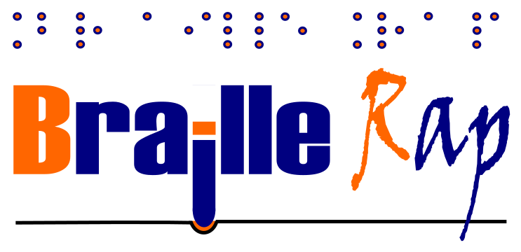</h1>

Fabrikarium 2016 : MyHumanKit, Airbus Group

CC-By-SA

FLOSS Manuals France, Simon Descarpentries

<ul>
 <li><a href="#introduction">Introduction</a></li>
 <li><a href="#contexte">Contexte</a>
 <ul>
  <li><a href="#les-reprap">Les RepRap</a></li>
  <li><a href="#les-fablab">Les FabLab</a></li>
  <li><a href="#le-réseau-e-nable">Le réseau e-Nable</a></li>
  <li><a href="#tour-dhorizon-de-lexistant">Tour d'horizon de l'existant</a>
  <ul>
   <li><a href="#braille-e-book">Braille e-Book</a></li>
   <li><a href="#plage-braille">Plage Braille</a></li>
   <li><a href="#lumipocket-3D-une-impression-3D-plastic">Lumipocket 3D, une impression 3D plastic</a></li>
   <li><a href="#impression-de-braille-sur-papier-jusquici-une-vision-dartiste">Impression de Braille sur papier, jusqu'ici une vision d'artiste</a></li>
   <li><a href="#braigo">Braigo</a></li>
   <li><a href="#basic-d-v4">Basic-D v4</a></li>
   <li><a href="#plage-braille-imprimée-en-3d">Plage Braille imprimée en 3D</a></li>
   <li><a href="#braillepost.be-et-les-cécogrammes">Braillepost.be et les cécogrammes</a></li>
  </ul>
  </li>
  <li><a href="#rappel-sur-lutilisation-dune-tablette-braille">Rappel sur l'utilisation d'une tablette Braille</a>
  <ul>
   <li><a href="#profondeur-des-trous-du-braille">Profondeur des trous du Braille</a></li>
  </ul>
  </li>
  <li><a href="#le-fabrikarium-2016">Le Fabrikarium 2016</a>
  <ul>
   <li><a href="#Équipe-du-projet-braillerap">Équipe du projet Braille<em>Rap</em></a>
</li>
  </ul>
  </li>
 </ul>
 </li>
 <li><a href="#le-logiciel-braillerap">Le logiciel Braille<em>Rap</em></a>
 <ul>
  <li><a href="#paramètres">Paramètres</a></li>
 </ul>
 </li>
 <li><a href="#le-pointeau">Le pointeau</a>
 <ul>
  <li><a href="#la-bavure">La bavure</a></li>
  <li><a href="#lembout-adaptable">L'embout adaptable</a></li>
  <li><a href="#supports-dembossages">Supports d'embossages</a></li>
 </ul>
 </li>
 <li><a href="#exemple-d-utilisation">Exemple d'utilisation</a>
 <ul>
  <li><a href="#préparation-de-limprimante-3d">Préparation de l'imprimante 3D</a></li>
  <li><a href="#préparation-de-limpression">Préparation de l'impression</a></li>
  <li><a href="#préparation-du-texte">Préparation du texte</a></li>
  <li><a href="#lancement-de-limpression">Lancement de l'impression</a></li>
 </ul>
 </li>
 <li><a href="#vidéo-démo">Vidéo démo</a></li>
 <li><a href="#pistes-d-optimisation">Pistes d'optimisation</a></li>
 <li><a href="#un-peu-dhumour">Un peu d'humour</a></li>
 <li><a href="#lexique">Lexique</a></li>
</ul>

Introduction
===

Braille*Rap* est un projet visant à écrire du Braille sur papier à l'aide d'une imprimante 3D. L'imprimante est ainsi utilisée pour creuser le relief des lettres Braille sur la feuille (et non construire des objets en plastique). Les lettres sont ainsi embossées point par point, à la vitesse de déplacement de la buse de l'imprimante utilisée comme pointeau, ce qui s'avère plus rapide et plus fiable que le travail d'un opérateur humain (même avec les machines les plus lentes), et incomparablement moins bruyant qu'une imprimante Braille commerciale.

Pour ce faire, le texte à imprimer est d'abord saisi dans le logiciel Braille*Rap* qui le converti en Braille lisible à l'écran puis en instructions de pilotage des outils industriels à commande numérique, le G-Code. Ce G-Code est alors transmis à une imprimante 3D libre, de la famille des RepRap. C'est d'ailleurs de ces machines de *rép*lication *rap*ide que le projet tire son nom !

Des solutions techniques spécialisées existent dans ce domaine, mais leur coût est prohibitif (plusieurs milliers d'euros), quand des milliers d'imprimantes 3D (coûtant 200 ou 300 € à produire) sont déjà disponibles, partout dans le monde, notamment via le réseau e-Nable, qui imprime déjà en 3D des prothèses de main d'enfant (plus de 400 prothèses à ce jour).

Contexte
===

Les RepRap
---

RepRap est, selon Wikipedia, la contraction de l'anglais *Replication Rapid prototyper*, pouvant se traduire par concepteur de réplication rapide. Il s'agit d'un projet britannique de l'Université de Bath lancé en 2005, visant à créer une imprimante tridimensionnelle en grande partie auto-réplicative et libre (c'est-à-dire sans brevet, et dont les plans sont disponibles pour tout le monde) sous licence publique générale GNU.

RepRap désigne également plus communément les imprimantes 3D réalisées par le projet RepRap. Ce projet est maintenant développé très activement par une communauté mondiale, à la manière du logiciel libre.

Par « auto-réplication » il faut comprendre qu'une imprimante RepRap est en grande partie constituée de pièces elles-mêmes imprimables en 3D, de sorte qu'une imprimante fonctionnelle est en mesure d'aider à fabriquer la plupart des pièces d'une nouvelle imprimante.

Des milliers d'imprimantes RepRap ont donc été construites, et elles équipent bon nombre de FabLabs.

Les FabLab
---

Un FabLab (contraction de l'anglais *fabrication laboratory*, ou « laboratoire de fabrication ») est, selon Wikipedia, un tiers-lieu de type makerspace, ouvert au public, où il est mis à disposition toutes sortes d'outils, notamment des machines-outils pilotées par ordinateur, pour la conception et la réalisation d'objets.

La caractéristique principale des FabLab est leur « ouverture ». Ils s'adressent aux entrepreneurs, aux designers, aux artistes, aux bricoleurs, aux étudiants ou aux hackers en tout genre, qui veulent passer plus rapidement de la phase de concept à la phase de prototypage, de la phase de prototypage à la phase de mise au point, de la phase de mise au point à celle de déploiement, etc. Ils regroupent différentes populations, tranches d'âge et métiers différents. Ils constituent aussi un espace de rencontre et de création collaborative qui permet, entre autres, de fabriquer des objets uniques: objets décoratifs, objets de remplacement, prothèses, orthèses, outils…

Pour être appelé FabLab, un atelier de fabrication doit respecter la charte des FabLabs. Celle-ci a été mise en place par le [MIT](abbr:Massachusetts Institute of Technology) mais elle est désormais supportée par la FabFoundation.

Les techniques de base des FabLabs sont :

- la conception, modélisation, construction par enlèvement de matière en 2D (fraisage)
- la conception, modélisation et impression 3D (construction par ajout de matière)
- l'algorithmie par l'écriture de code embarqué ou pilotant les outils précédents
- la documentation, libre, du travail réalisé

En mai 2016, il existe selon Wikipedia 673 FabLabs dans le monde dont 82 en France (des établissements pioniers, mais aussi beaucoup d'[EPN](abbr:Espaces Publics Numériques) convertis).

Le réseau e-Nable
---

Le 24 octobre 2014, une fillette de 5 ans, née avec une main gauche incomplète, devint le premier enfant anglais équipé d'une prothèse de main réalisée en impression 3D. Sa main fut conçue par l'association e-Nable, une communauté de concepteurs d'objets 3D composée d'un réseau de volontaires répartis dans le monde et comptant plusieurs milliers (7000 en 2016) d'imprimantes 3D de type RepRap. La prothèse était basée par un moulage en plâtre de la main de l'enfant, réalisé par les parents et transmis aux membres du réseau. Des prothèses plus complexes, importantes et motorisées ont été réalisées depuis (intégrant des contrôles par impulsion électrique musculaire) par ces volontaires, qui ont à ce jour réalisé plus de 400 prothèses de main d'enfant.

Le projet Braille*Rap* s'inscrit dans cet élan, et vise à apporter, entre autre à ses milliers de bénévoles, un moyen rapide, efficace et peu onéreux d'imprimer à la demande de grandes quantitésde Braille partout dans le monde.

Tour d'horizon de l'existant
---

### Braille e-Book

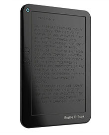 |
--- |
*Modélisation du concept par Yanko Design* |

Un livre numérique (ou e-Book) Braille, est une plage Braille autonome, capable d'afficher l'équivalent, en nombre de lignes, d'une page de livre, d'un coup. Pour y parvenir, des électro-aimants ou de la cire chauffée, plutôt que des plots mécaniquement déplacés pour représenter les points des lettres Brailles. Bien que la technologie ne soit pas particulièrement chère, les faibles volumes de production de ces dispositifs les rendent fort onéreux. Un concept coréen conçu par Yanko Design a attiré l'attention en 2009. En 2013, un prototype anglais appelé « Anagraphs » financé par l'Union Européenne a échoué à atteindre le stade de la production. La companie autralienne Blitab a annoncé la production, pour le 4e trimestre 2016 d'une tablette Braille e-Book, à un prix attendu autour de 3000 €.

### Plage Braille

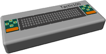 |
--- |
*Exemple de plage Braille, la Tactis100* |

Une plage braille (en anglais *refreshable Braille display*) est un dispositif électro-mécanique utilisé par les aveugles pour afficher en temps réel des caractères Braille, le plus souvent issus d'un ordinateur. Habituellement, ces caractères apparaissent sous forme de points saillants sur une surface plane (papier spécifique en général).

En juillet 2015, le coréen Cheonan-Si a lancé son premier modèle de plage Braille à 100 caractères, la Tactis100 (4 lignes de 25 caractères), remontant les standards d'un marché concentrés sur des dispositifs de 20, à 80 caractères. Le prix de la Tactis100 est également présenté par le fabricant comme une évolution du marché, avec 2000 USD pour 100 caractères, contre 7000 USD pour 80 caractères habituellement.

### Lumipocket 3D, une impression 3D plastic

<!--  | -->
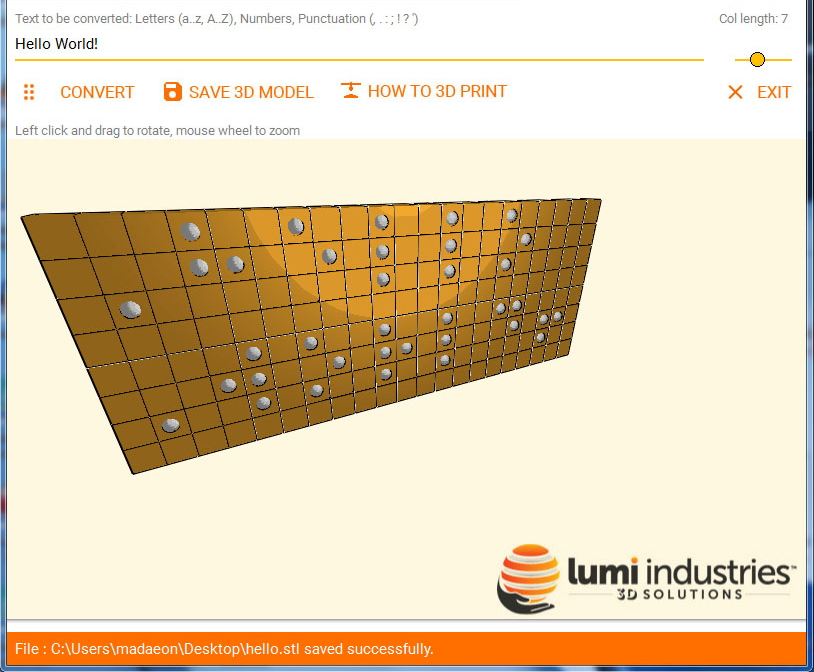 |
--- |
*Modèle 3D d'une plaque Braille à imprimer* |

L'entreprise Lumi Industries a conçu le Lumipocket DLP 3D, une petite imprimante 3D, annoncée en même temps qu'un logiciel capable de convertir du texte en Braille, à imprimer ensuite sous la forme d'une plaque dotée du relief des lettres du Braille. Ce logiciel est issu d'une collaboration entre Lumi Industries et Librarylyna, un projet visant à regrouper une grande collection de modèles de plaques Braille éducatives.

Ce principe pose toutefois le problème de la quantité de matière première utilisée pour la production des plaques imprimées.

### Impression de Braille sur papier, jusqu'ici une vision d'artiste

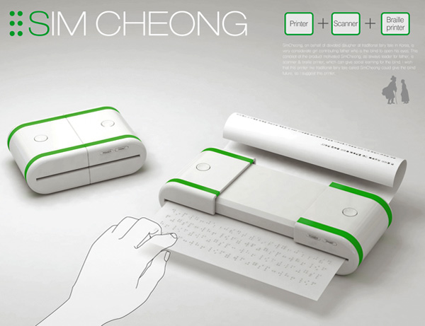 |
--- |
*Le concept d'imprimante et scanner Braille de SimCheong* |

Inspiré par une histoire coréenne, cette imprimante télescopique A6-A4 à l'apparence attrayante a un objectif simple : rendre les ordinateurs plus accessible aux mal-voyants.

Malheureusement, l'artiste à l'origine de ce concept déplorait en 2012 qu'il soit impossible de réaliser l'idée en l'état actuel des technologies.

### Braigo

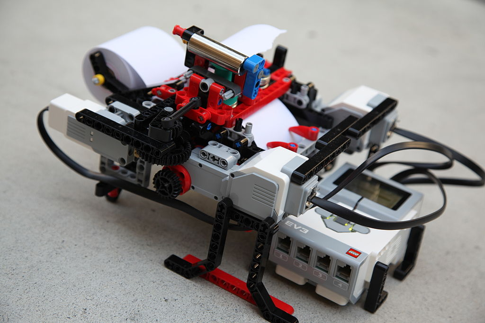 |
--- |
*Braigo, assemblage Lego Mindstorm imprimant du Braille* |

Braigo (contraction de *Brai*lle + Le*go*) est le nom d'un concept d'imprimante Braille sur papier. La version 1.0 fut construite avec un kit Lego Mindstorms EV3, contenant un microprocesseur, et un ensemble d'effecteurs motorisés et de capteurs. C'est un enfant de 13 ans, Shubham Banerjee, qui l'a réalisé en 2014, dans le cadre d'un projet scolaire.

Cette imprimante présentait l'avantage d'un coût modique (entre 250 à 350 euros), quand les imprimantes Braille conventionnelles du marché démarrent à 1 900 USD.

Sa capacité d'impression est toutefois limitée à une bande de papier de facturette.

Le jeune inventeur travaille depuis sur de nouveaux modèles.

### Basic-D v4

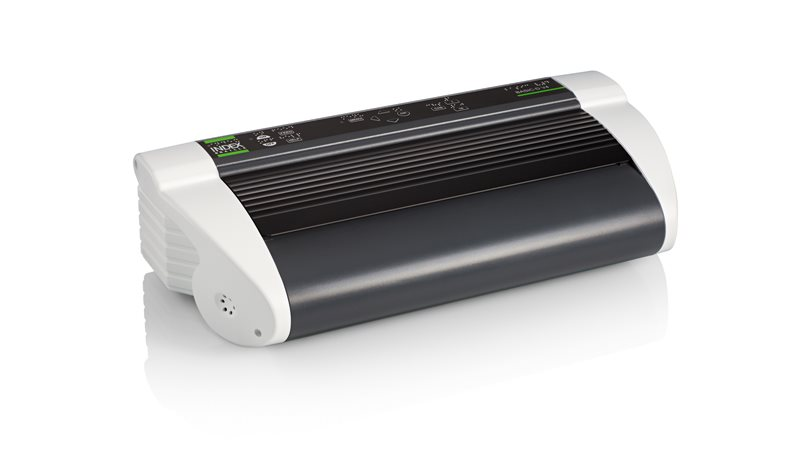 |
--- |
*Basic-D v4, exemple d'imprimante Braille du marché* |

La Basic-D v4 se réclamme comme l'une des imprimantes Braille embossant du papier les plus vendues dans le monde.

Pour 2 495 USD, elle affiche une performance de 100 caractères par seconde.

### Plage Braille imprimée en 3D

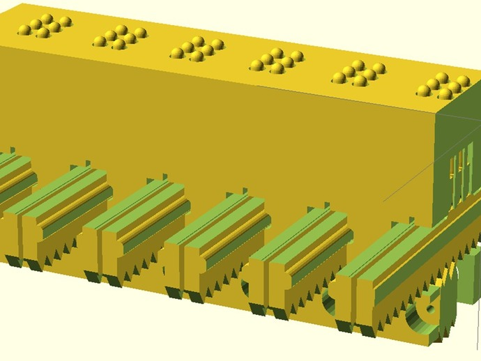 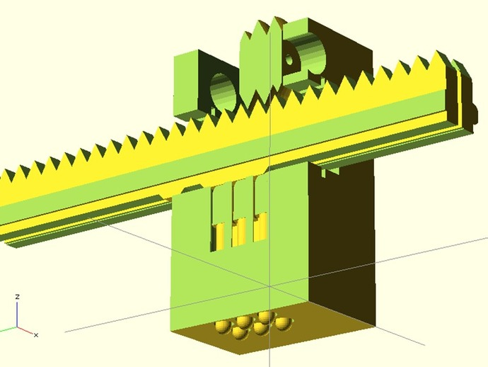 |
--- |
*Projets BRAVE et COVE, extraits de modèles de plage Braille imprimée* |

Prototypé pour l'équipe UCMerced Capstone, l'équipe BRAVE (pour Braille Reader for Assisting the Visually impairEd), en partenariat avec l'équipe COVE (the Center of Vision Enhancement), Merced et Solidoodle.

Leur assertion de départ est que le coût élevé des plages Braille que l'on peut trouver dans le commerce, joue un rôle important dans le fait que seuls 10% d'enfants aveugles ont l'opportunité d'apprendre le Braille. Pour améliorer cette situation, ils ont donc conçu une plage Braille imprimable en 3D.

Chaque caractère Braille y est rendu lisible à l'aide d'un dispositif proche des goupilles d'une serrure.

### Braillepost.be et les cécogrammes

L'association Belge Braillepost se propose de jouer l'intermédiaire pour n'importe quelle impression Braille à destination d'un mal-voyant, se basant sur le fait que les postes accordent la gratuité aux cécogrammes.

Rappel sur l'utilisation d'une tablette Braille
---

 |
--- |
*Tablette d'écriture Braille traditionnelle, feuille, réglette et pointeau* |

Une tablette Braille traditionnelle est composée d'une plaque de métal pré-embossée de plusieurs lignes de caractères Braille, eux-mêmes composés de 3 lignes de 2 points, ou creux. La tablette est de plus équipée d'ergots pointus à intervalles réguliers sur le pourtour de la tablette.

À cette plaque s'ajoute un cadre perforé de manière à ce que les trous correspondent aux ergots de la plaque. Il est ainsi possible de maintenir solidement en place une feuille de papier perforée par les ergots et retenue par le contre-cadre. Les trous effectués par les ergots permettent également de libérer et repositionner exactement les feuilles embossées.

Les feuilles utilisées sont préférentiellement du papier épais, 160g / m^2. Il est tout à fait possible de recycler du papier, des couvertures de magazine, des chemises cartonnées…

Une fois la feuille positionnée, une règlette est encastrée sur le cadre / rabat, positionnée sur des ergots pointant depuis l'extérieur du cadre. Cette règlette comporte deux séries de fenêtres, chacune permettant de guider le pointeau qui viendra embosser la feuille, point par point.

Dans le cadre de la réalisation initiale du projet Braille*Rap*, être accompagné d'une personne mal-voyante sachant se servir d'une telle tablette fut essentiel. Notamment pour établir les exemples à suivre.

### Profondeur des trous du Braille

Une série de mesures ont été effectuées sur des lettres Braille embossées à l'aide d'une tablette Braille traditionnelle.

Profondeur d'un point :

- Mesure : 0,35mm
- Théorie : 0,48mm

Espacement entre deux points d'une lettre :

- Mesure : 2,7mm
- Théorie : 2,3mm

Les valeurs théoriques sont extraites de : [Braille Authority of North America][bana-size].
[bana-size]: http://www.brailleauthority.org/sizespacingofbraille/index.html

On constate donc que la question traitée ici est une question de précision, l'objectif étant de produire des creux de l'ordre du demi-millimètre dans du papier.

Le Fabrikarium 2016
---

<!--  | -->
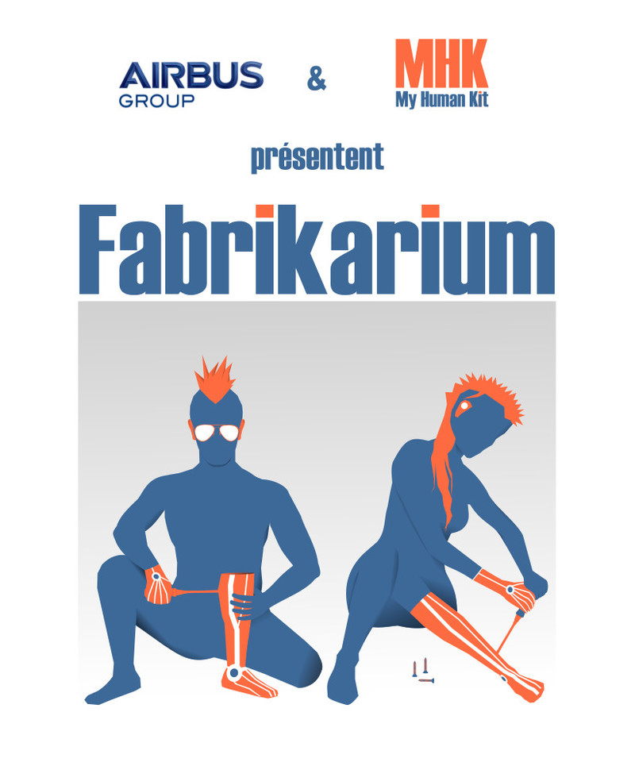 |
--- |
*Affiche du Fabrikarium 2016* |

Du 19 au 21 octobre 2016, plus de 120 volontaires (bénévoles de l'association MyHumanKit, salariés d'Airbus Group et docsprinters de l'association FLOSS Manuals France), de divers ages et de parcours variés se sont réunis à Toulouse au Lycée Professionnel d'Airbus, afin de travailler sur les 11 projets proposés par MyHumanKit, au cours de l'évènement « Fabrikarium 2016 » organisé en collaboration et avec l'appui technique d'Airbus Group.

Braille*Rap* faisait partie de ces projets, et voici la liste des volontaires qui ont travaillé dessus :

### Équipe du projet Braille*Rap*

- **Hugues Aubin**, coordinateur MyHumanKit (depuis le 1er avril 2016)

  Responsable du projet Braille*Rap*

  « *Le Hackathon n'est pas une compétition, n'hésitez-pas à aider les tables autour.* »
- **Damien Canac**, équique Saint Gobain
- **Simon Descarpentries**, ingénieur en informatique, gérant d'Acoeuro.com

  Présent via l'association [FLOSS Manuals France](https://flossmanuals.net), en temps que docsprinter
- **Yassine El Yacoubi**, BNP Paribas (pôle innovation, incubateur parisien startup)
- **Élodie Fourment**, élève au Lycée Airbus

  « *Ne doute pas de tes capacités sous prétexte que tu ne sais pas ce que tu peux apporter à l'équipe* »

- **Arezki Gastaud**, danseur classique puis, élève ingénieur en informatique en alternance via CapGemini
- **François Le Berre**, Airbus Safran (*Les Mureaux*), R&D surveillance de l'espace

  « *Voir passer les satellites…* »

  François est entre autre le garant des réalisations du projet de part sa maîtrise du Braille, acquise au début de ses études pour pallier son handicap visuel. De son propre aveu, il utilise peu le Braille au quotidien, si ce n'est pour vérifier de quelle boîte de médicament il se saisit…

   François présentera le projet en décembre 2016 à la conférence *New technology* organisée par la [Fédération des Aveugles de France.](http://www.aveuglesdefrance.org/) à la Cité des Sciences de Paris.

- **Arthur Masson**, ingénieur en imagerie numérique

  Membre de l'association [Indiens dans la ville (IDLV)](http://idlv.tumblr.com/)
- **Delphine Paillon**, Airbus bureau Group, Finance Community Manager au bureau du CFO, océanographe de formation, reconvertie en RH puis en Gestion des Compétences suite à un MBA en cours du soir et ardente défenseuse de l'intelligence collaborative.

  « *Réaliser une idée, mais à plusieurs…* »

- **Sébastien Rey**, Airbus, costing (études de coûts)

Le logiciel Braille*Rap*
===

Le logiciel libre Braille*Rap*, est directement utilisable à l'adresse : https://arthursw.github.io/BrailleRap/

Son code source est également disponible dans ce dépôt de code, sous licence MIT.

Son utilisation est extrêmement simple, saisissez le texte voulu dans la 1ère case de texte. À chaque lettre saisie, la représentation Braille du texte est affichée dans le cadre situé dessous. Le 3e cadre présente le G-Code à communiquer à l'imprimante 3D.

En haut à gauche, une fenêtre survole ces 3 cadres. Elle présente une série de paramètres ainsi qu'un bouton « download » permettant de télécharger le G-Code produit, dans l'hypothèse où cela faciliterait la transmission au logiciel de gestion de l'imprimante 3D visée.

Paramètres
---

Toutes les dimensions sont en millimètres.

- Paper dimensions :
  - **paperWidth** : largeur de la feuille à imprimer
  - **paperHeight** : hauteur de la feuille à imprimer
  - **marginWidth** : marge lattérale à l'intérieur de la zone à imprimer
  - **marginHeight** : marge au dessus et en dessous du texte imprimé
- Braille letter dimensions :
  - **letterWidth** : largeur des lettres
  - **dotRadius** : diamètre des points (dans la représentation Braille à l'écran)
  - **letterPadding** : marge autour des lettres
  - **linePadding** : écart entre les lignes
- Printer settings :
  - **headDownPosition** : position basse du pointeau lors de l'embossage du papier
  - **headUpPosition** : position haute du pointeau entre deux points embossés
  - **speed** : vitesse de déplacement du pointeau entre deux points embossés (en millimètre par seconde)
  - **delta** : à cocher si l'imprimante utilisée est une imprimante delta (à trois colonnes) par opposition aux imprimantes à coordonnées cartésiennes (proche d'une table traçante)
- **language** : type de Braille utilisé (lettres codées sur 6 ou 8 points, nouveaux ou anciens)

Dans cette même fenêtre survolante, à fond noir, la dernière ligne est en fait un bouton **saveGCode**, permettant de télécharger le G-Code produit sous forme de fichier importable ensuite dans le logiciel de pilotage de l'imprimante choisie.

Le pointeau
===

Pour obtenir un bon embossage, il faut marquer le papier suffisamment profondément, mais sans toutefois le percer (ce dernier perdant alors de sa résistance mécanique, et donc de sa capacité à être lu de nombreuses fois).

La bavure
---

Une première idée, qui permet d'obtenir un embossage correct, est d'utiliser directement la buse de l'imprimante, prolongée d'une bavure de 2 à 10 millimètres faite du plastique généralement imprimé. Une bavure trop courte n'aboutirait pas à des embossages suffisamment profonds pour être confortablement lus, et une bavure trop longue finirait par se plier sous la contrainte.

L'embout adaptable
---

<!-- |-->
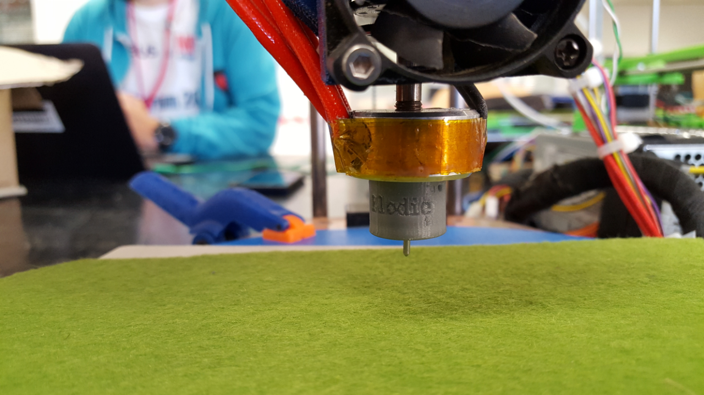 |
--- |
*Embout pointeau monté sur buse d'imprimante 3D (delta)* |

Pour travailler de manière plus pérenne, nous recommandons d'utiliser un embout, lui-même imprimé en 3D à partir des modèles fournis dans ce dépôt :

- [Fichier OpenSCAD personnalisable](../Pointeau/Braille_buse.scad)
- [Fichier STL imprimable pour buse à 6 pans de 10 mm](../Pointeau/couvre_buse_elodie_9.2.STL)
- [Dessin industriel au format PDF](../Pointeau/Plan_couvre_buse_9.2.PDF)

L’idée a été d’adapter ou de copier le pointeau dont se servent les Braillistes, puis de le monter sur l’imprimante 3D pour qu’elle devienne « Brailliste » à son tour. Pour ce faire, nous nous sommes inspirés d’une tablette et d’un pointeau Braille standards.

<!--  | -->
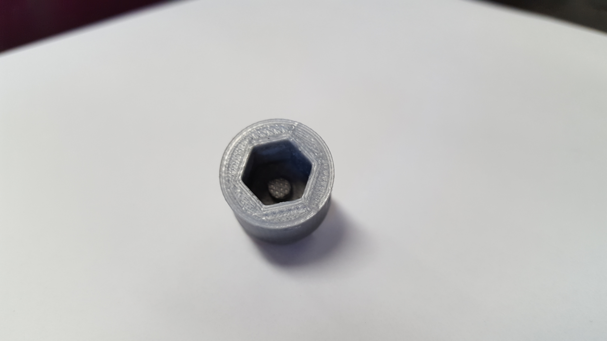 |
--- |
*Embout imprimé vu de 3/4 dessus* |

Cet embout est un cylindre qui aura toujours la même hauteur une fois terminé. Ce cylindre est creu, "perforé" d'un trou hexagonal à imprimer de la taille des pans de la buse de votre imprimante de manière à pouvoir l'emboiter, avec suffisamment de contrainte pour qu'il tienne en place.

L'autre extrêmité du cylindre est pleine, à l'exception d'un trou central, par lequel vient s'emboiter un object pointu, comme un clou de tapissier, qu'il convient de coller une fois positionner (une goutte de colle forte à prise rapide cyanoacrylates suffit). Un bon clou mesure de 1 à 2 millimètres de diamètre, sur 1 à 2 centimètres de long. Si le clou s'emboite difficilement dans l'embout, il est possible de le chauffer à l'aide d'un briquet ou d'un fer à souder, car une fois chaud il assouplira le plasique de l'embout.

La pointe saillante doit toutefois être limée, pour être arrondie, afin de ne pas percer le papier à embosser.

Supports d'embossages
---

<!--  | -->
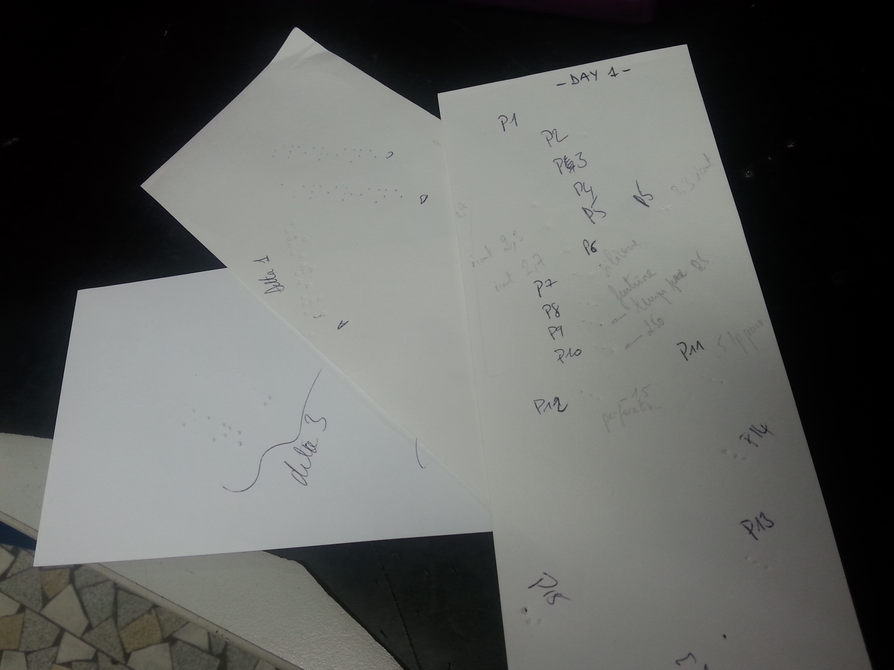 |
--- |
*"Tirs" d'essais d'embossage* |

De nombreux tests d'embossage ont été réalisés lors du Fabrikarium 2016. À différentes vitesses, et différentes profondeurs, sur différents supports…

Un élément clé pour un bon embossage, c'est de placer la feuille sur un support souple, non rémanent (qui va donc reprendre sa forme entre deux points embossés) :

- couche de silicone, 3 millimètres d'épaisseur, comme un plat à tarte ;
- feutrine, 3 millimètres d'épaisseur également (au moins) ;
- couche de tapis de sol…

Superposer une couche de feutrine sur une couche de silicone abouti à de bons résultats.

Exemple d'utilisation
===

Préparation de l'imprimante 3D
---

Mesurer l'écrou hexagonal de la buse d'extrusion pour imprimer un embout pointeau compatible avec l'imprimante visée (par exemple à partir de nos modèles) ;

Préparation de l'impression
---

Se munir d'un support souple mais résistant afin de protéger le plateau (une vitre dans notre cas) de l'imprimante.

Comme vu précédemment, nous recommandons une plaque de silicone (type appareil de cuisson pour gâteau, Flexipan, vieux tapis de souris posé à l'envers ou encore feutrine). Nous avons utilisé une plaque de silicone recouverte d'un bout de feutrine.

Déposer ce support sur le plateau de l'imprimante, et le fixer (par exemple à l'aide de pinces).

Il est important de réaliser une bonne installation de l'impression, avec un étalonnage minutieux du zéro, car le problème traité ici est une question de précision, il s'agit d'imprimer au papier des creux de 0,48 millimètres.

Pour ce faire, descendre la nouvelle tête d'impression (équipée de votre pointeau) manuellement vers le support disposé sur le plateau d'impression. Le réglage de la hauteur 0 idéal s'obtient lorsque la tête du pointeau affleure le dessus du support d'embossage, c'est-à-dire juste à ras de la feutrine (ou autres supports). Pour vérifier que vous êtes au bon niveau, vous pouvez essayer de glisser une feuille de papier, la feuille ne doit pas pouvoir passer sous la tête du pointeau.

Dans notre cas, cette position zéro était alors enregistrée dans le logiciel de pilote d'imprimante via la commande G-Code suivante : **G92 Z0**

Relever alors la tête d'impression de 10 mm (commande **G1 Z10**), afin de pouvoir glisser le
papier ou carton à imprimer et de le positionner sur le support souple. Votre imprimante est prête !

Préparation du texte
---

Charger l'URL suivante dans un navigateur : https://arthursw.github.io/BrailleRap/

Dans le premier cadre, saisir la version alphabétique du texte à imprimer en Braille. Le texte équivalent traduit en Braille apparaît alors dans le seconde cadre. Puis, dans le 3e cadre, la séquence de G-Code correspondante est également générée automatiquement en fonction des paramètres spécifiés.

Il est alors possible de copier/coller ce code directement dans la console du logiciel de pilotage de l'imprimante, ou de télécharger le fichier G-Code pour le transmettre sur le bon poste.

Lancement de l'impression
---

Il est maintenant possible de lancer l'impression Braille, en validant votre entrée.

Il est recommandé de maintenir la feuille à imprimer pour ne pas qu'elle se déplace pendant l'impression, mais attention aux doigts !

<!--  | -->
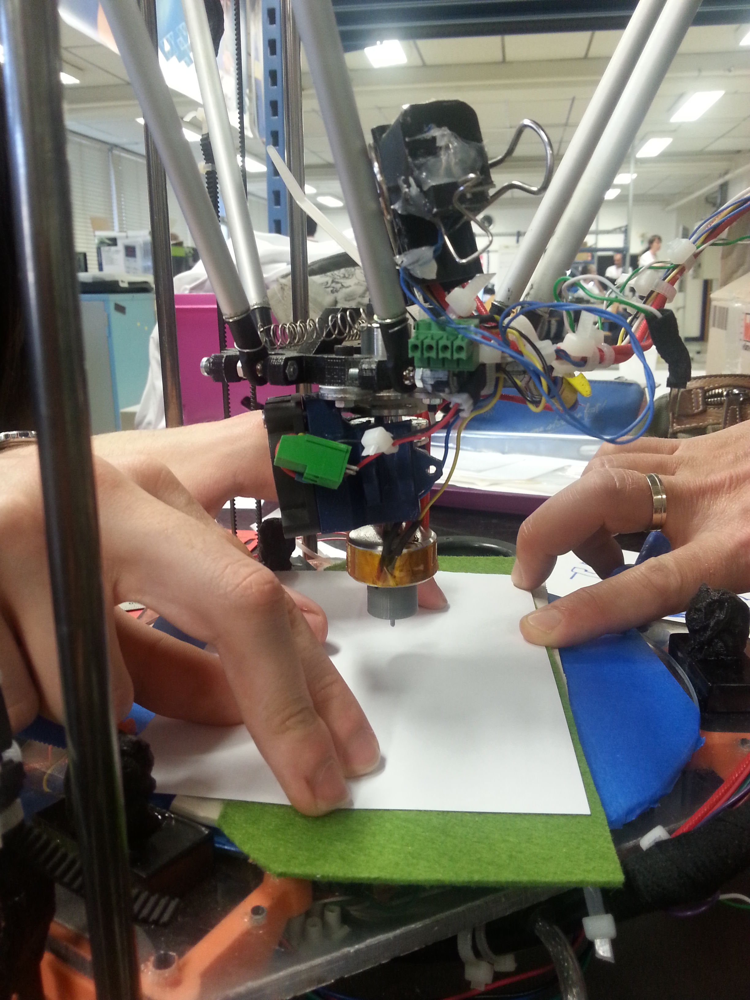 |
--- |
*Lancement de l'impression, attention aux doigts !* |

Vidéo démo
===

[Cliquer ici pour voir un GIF animé d'impression](img/20161020_VIDEO_FABRIKARIUM_320.gif).

Pistes d'optimisation
===

- prise en charge des alphabets Braille étendus (à 4 lignes de 2 points) dans la partie logicielle ;
- design paramétrique de la taille du capuchon / pointeau, pour s'adapter à toutes les tailles de buses d'imprimante 3D ;
- imprimer un caractère à la fois via une tête à 6 plots, un cylindre / boîte à musique ;
- imprimer une ligne d'un coup, et pas lettre par lettre ;
- imprimer sur papier fin en mouillant, thermo-formant, puis séchant ?

Un peu d'humour
===
Que dit un aveugle auquel on donne une feuille de papier de verre à lire ?

- Mais que c'est écrit serré !

Lexique
===

**ABS** : Acrylonitrile Buto-Styrene (plastique dur thermoformable), utilisé comme matière première d'imprimante 3D sous la forme de bobines de fil à fondre et thermo-former.

**Braille** : Système d’écriture tactile à points saillants, à l’usage des personnes aveugles ou fortement malvoyantes.

**Buse** : Conduit ou tuyau qui sert à l'écoulement d'un fluide.

**Cécogramme** : Un cécogramme (du latin « caecus », « aveugle », et du grec « γράμμα », « caractère ») est un courrier ou un colis contenant des documents envoyés ou reçus par des déficients visuels (aveugles ou malvoyants) ou par les organisations qui les assistent (associations, établissements d'éducation spécialisée, etc.), et qui bénéficient de ce fait d'une franchise totale ou partielle dans les systèmes postaux de nombreux pays.

**Embossage** : Faire une bosse, imprimer en relief. Ici, sur une feuille de papier, pour chaque point d'une lettre Braille.

**PLA** : Acide Polylactique (bio-pastique). Matière plastique d'origine végétale, bio-dégradable, utilisée comme matière première d'imprimante 3D, sous la forme de bobines de fil à fondre et thermo-former.

